# ExtGfx

Sada grafických objektů ("widgetů") pro **ePaper a LCD/TFT/OLED displeje,** pro které je k dispozici knihovna implementující rozhraní **Adafruit_GFX.**

Několik ukázek:

| Grafy      | Práce s textem      | Bar gauge |
| ----------- | ----------- | ----------- |
| 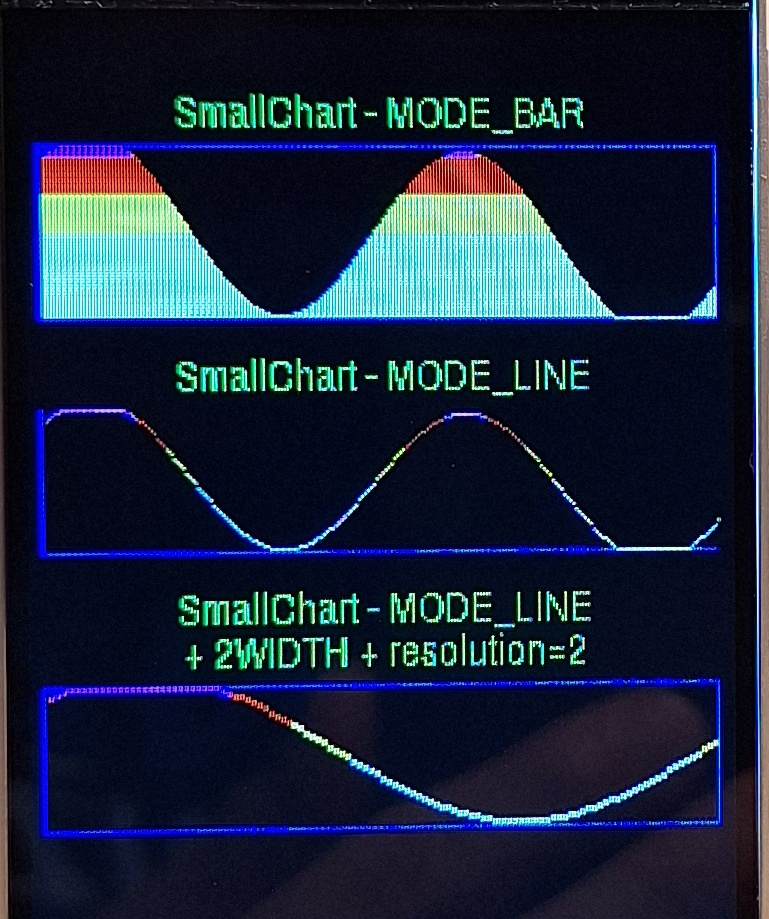  | 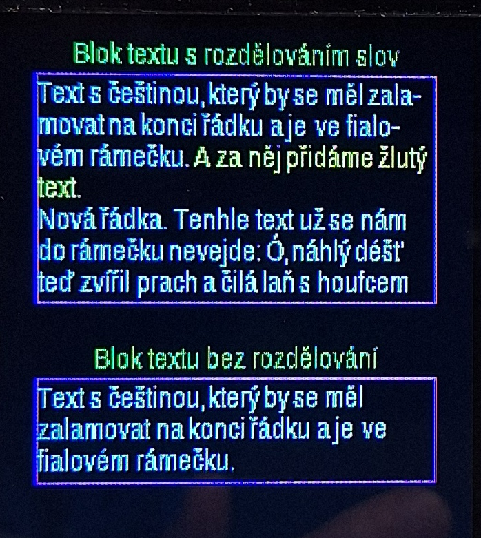   | 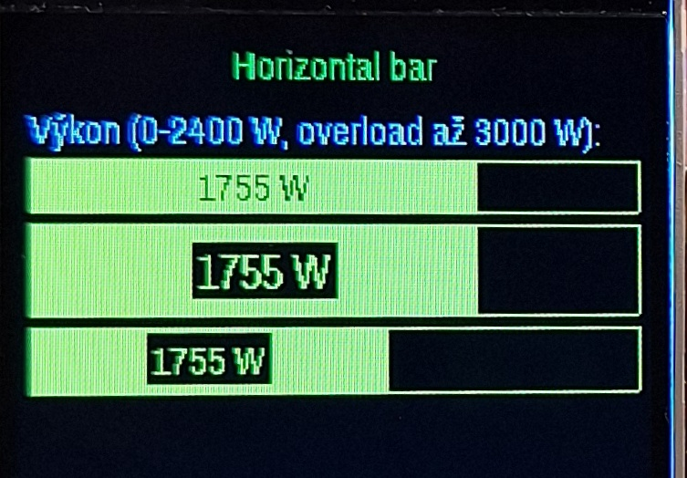 |
| 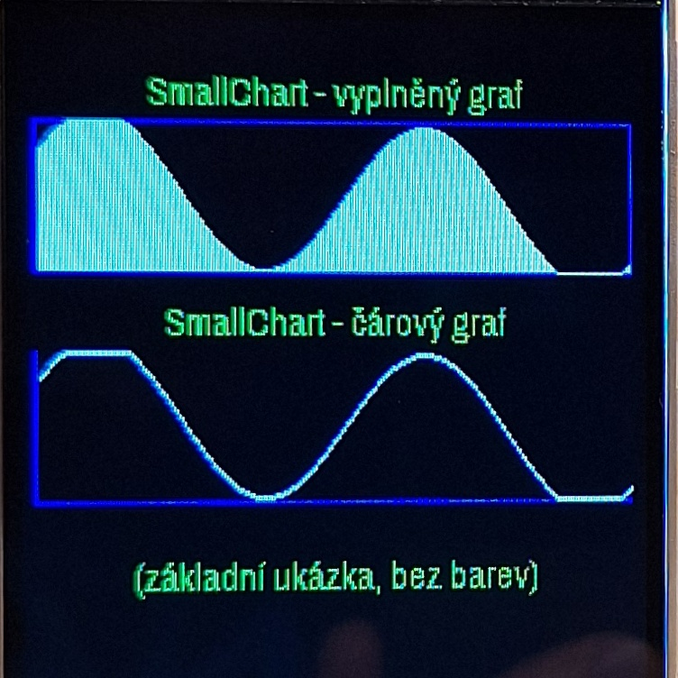  | 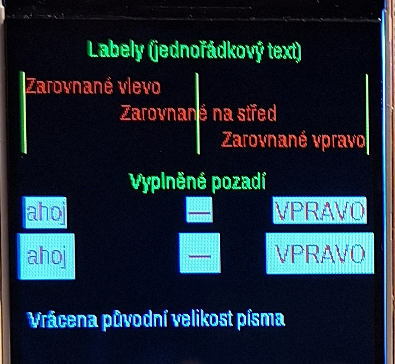   | 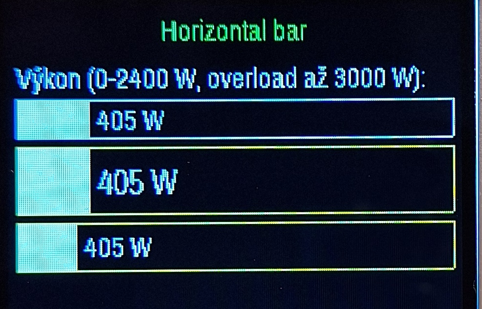 |


Knihovny jsou určené pro ESP32; asi budou fungovat i na ESP8266, ale nešetří pamětí.

## Práce s textem

Objekt [TextPainter](src/extgfx/TextPainter.h) zajišťuje práci s textem.

Umí tisk textu s **UTF-8 češtinou** pomocí fontů připravených postupem popsaným zde: https://github.com/petrbrouzda/fontconvert8-iso8859-2 .

Implementuje tisk textu do bloku se skoro korektním rozdělováním slov na konci řádků. Zde je ukázka - nahoře s rozdělováním, dole bez:


Tisk jednořádkových textů ("labelů") se zarovnáním na určenou stranu, s možností automatického podbarvení pozadí.


Detailní kontrola nad řádkováním. 

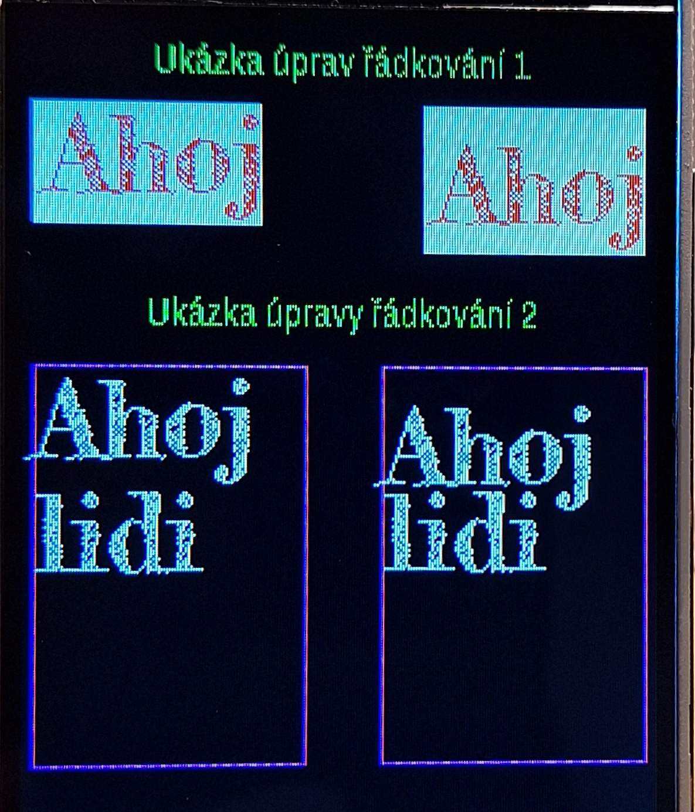
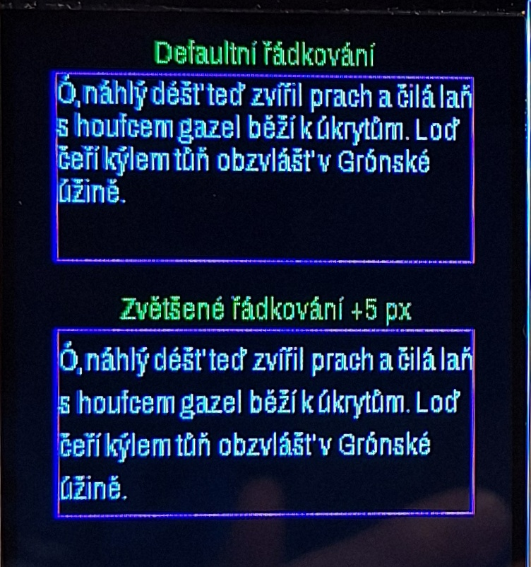


Demo a ukázky, jak se používá, najdete v [ExtGfx.ino](ExtGfx.ino) ve funkcích:
* demo1_zakladniTextovyBlok()
* demo2_labely()
* demo3_zmenaRadkovani()
* demo4_upravyRadkovaniFontu2()

## Horizontal bar gauge ("progress dialog")

Je implementován v  [HorizontalBar](src/extgfx/HorizontalBar.h).

Umí udělat indikátor různých velikostí. Implementuje "barevnou paletu", kde určíte, jaké mají být barvy pro jednotlivé rozsahy vstupních hodnot. Takže pro normální stav může být indikátor bílý, pro vysoké hodnoty červený atd.

Informační text se zobrazovanou hodnotou se ukazuje ve středu barevného pruhu; pokud je barevný pruh moc krátký, text se zobrazí vpravo od něj.


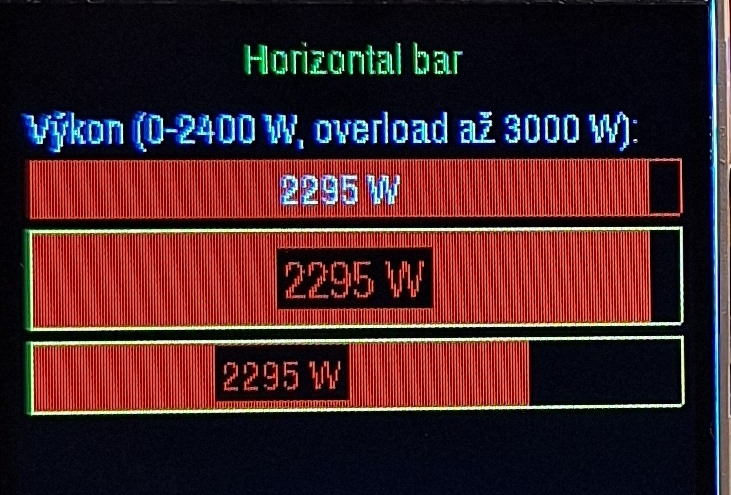
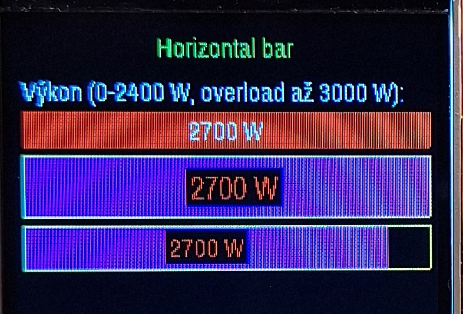

Demo a ukázky, jak se používá, najdete v [ExtGfx.ino](ExtGfx.ino) ve funkci demo5_horizontalBar().

## Jednoduché grafy

Najdete je v  [SmallChart](src/extgfx/SmallChart.h).

Demo a ukázky, jak se používají, najdete v [ExtGfx.ino](ExtGfx.ino) ve funkcích:
* demo9_smallChart()
* demo6_smallChart1()
* demo7_smallChart_bar()
* demo8_smallChart_line()

Základní ukázka jednobarevného grafu - s vyplněním, jen čára. Můžete volně určit, které okraje grafu budou vykreslené - v horním grafu jsou zapnuté všechny, v dolním jen levý a dolní.


Graf může být obarven podle hodnoty zobrazované veličiny - např. bíle standardní stav, červeně hodnoty blížící se limitu. Ve vyplněném grafu zde vidíte obarvení horizontální, kde se v grafu zabarvují jen hodnoty nad určenou úrovní:


Též je možné nastavit obarvení vertikální, kde se pro daný rozsah hodnot aplikuje barva na celé výšce grafu:

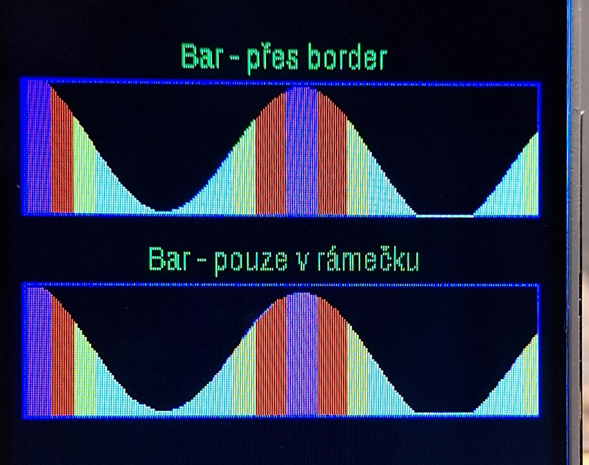

Je možné určit, zda je celý graf v prostoru mezi okraji (pokud jsou vykresleny), nebo zda dolní okraj funguje zároveň jako nejnižší hodnota ("osa X") a horní okraj jako nejvyšší hodnota. U čárového grafu je možno u větších displejů zapnout dvojitou tloušťku čáry pro vyšší čitelnost.

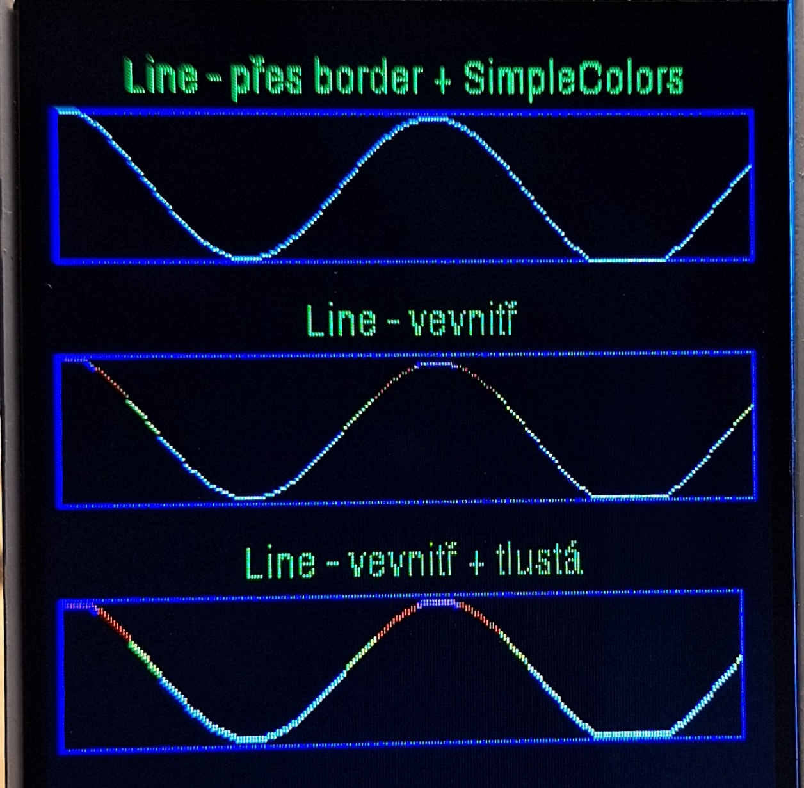


## Demonstrační aplikace

Demo [ExtGfx.ino](ExtGfx.ino) je určeno pro ESP32-C3 a levný 3.2" 240x320 displej s driverem ST7789 (https://s.click.aliexpress.com/e/_Dd1MOOf).

Po změně inicializace displeje by měla fungovat s čímkoli, co podporuje Adafruit_GFX. Pokud je váš displej menší než 240x320, pak samozřejmě bude potřeba upravit souřadnice a velikosti v jednotlivých ukázkách.


## Q & A

### Jak to zahrnu do své aplikace?

Nakopírujte do své aplikace adresář **src**.
A pak si do svého .ino souboru vložte includy objektů, které potřebujete:

```
#include "src/extgfx/TextPainter.h"
#include "src/extgfx/HorizontalBar.h"
#include "src/extgfx/SmallChart.h"
```

a můžete je používat - tak, jak je ukázáno v demu.

Pokud nutně chcete zmenšit aplikaci, smažte z src/extgfx/ objekty, které nepotřebujete.

### Proč to není jako Arduino knihovna?

Mám špatné zkušenosti s řešením závislostí na Arduino knihovnách v Arduino IDE. Vždy se najde kombinace projektů, které chtějí něco navrájem nekompatibilního. Pokud si specifické knihovny nesete s projektem, jeho kompilace jinde je jednodušší.

### Jak získám fonty s podporou češtiny?

Viz https://github.com/petrbrouzda/fontconvert8-iso8859-2 


## Cizí kód použitý v aplikaci

### src/gfxlatin2/
Nástroje pro konverzi UTF-8 do 8bit kódování a pro práci s Adafruit GFX fonty v tomto kódování.

Michel Deslierres, michel@sigmdel.ca, https://www.sigmdel.ca/michel/program/misc/gfxfont_8bit_en.html

Proti původní verzi upravena pro české kódování, originál byl pro Francouze.

### src/RingBuff/
Knihovna pro ring buffer. 

D. Aaron Wisner, daw268@cornell.edu, https://github.com/wizard97/ArduinoRingBuffer

Proti původní verzi doplněna možnost kompilace na ESP32, byť bez možnosti použití z ISR.

### fonty/

Fonty z Google Fonts, zpracované postupem dle https://github.com/petrbrouzda/fontconvert8-iso8859-2 


## Závislosti na externích knihovnách

Očekává se, že v Arduino IDE máte odpovídající Adafruit GFX knihovnu pro váš displej. Konkrétní závislosti pro  displej použitý v demu vypadají takto:
* "Adafruit ST7735 and ST7789 Library" 1.10.0
* "Adafruit GFX Library" 1.11.8 
* "Adafruit BusIO" 1.14.4 
* "Wire" 2.0.0 
* "SPI" 2.0.0

Kompilace je otestována na ESP32 core pro Arduino **2.0.11**.

